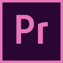

<h1 align="center">Hello there, I'm Christian 👋</h1>

Systems Engineering student for National University of Saint Augustine

  

## About 🎉:
* Currently a sophomore.
* Mostly interested in back-end development.
* Partially interested in videogame development.

## Currently volunteering for 🤝:
* Student Chapter IEEE Computer Society UNSA **<->** Webmaster

  

## Stack ☝️:
   <table>
    <tr>
      <td>Perl</td>
      <td></td>
    </tr>
    <tr>
      <td>Java</td>
      <td></td>
    </tr>
    <tr>
      <td>C#</td>
      <td></td>
    </tr>
    <tr>
      <td>LaTeX</td>
      <td></td>
    </tr>
    <tr>
      <td>MySQL</td>
      <td></td>
    </tr>
    <tr>
      <td>JavaScript</td>
      <td></td>
    </tr>
    <tr>
      <td>Python</td>
      <td></td>
    </tr>
    <tr>
      <td>Processing</td>
      <td></td>
    </tr>
    <tr>
      <td>Lua</td>
      <td></td>
    </tr>
    <tr>
      <td>HTML5</td>
      <td></td>
    </tr>
    <tr>
      <td>CSS3</td>
      <td></td>
    </tr>
  </table>

## Others 👇:
  <table>
    <tr>
      <td>Git</td>
      <td></td>
    </tr>
    <tr>
      <td>Arduino</td>
      <td></td>
    </tr>
    <tr>
      <td>OpenCV</td>
      <td></td>
    </tr>
    <tr>
      <td>Photoshop</td>
      <td></td>
    </tr>
    <tr>
      <td>Premiere Pro</td>
      <td></td>
    </tr>
    <tr>
      <td>Unity</td>
      <td></td>
    </tr>
    <tr>
      <td>Visual Studio Code</td>
      <td></td>
    </tr>
  </table>
